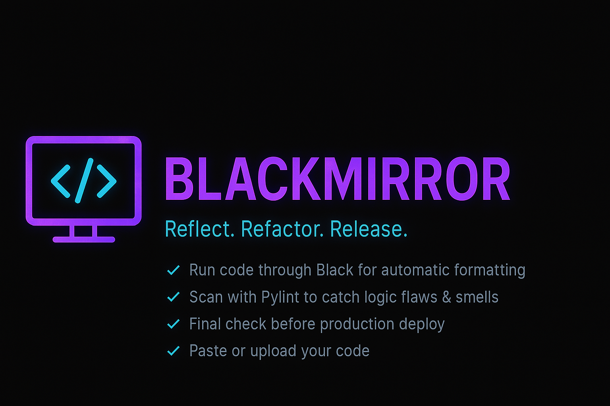
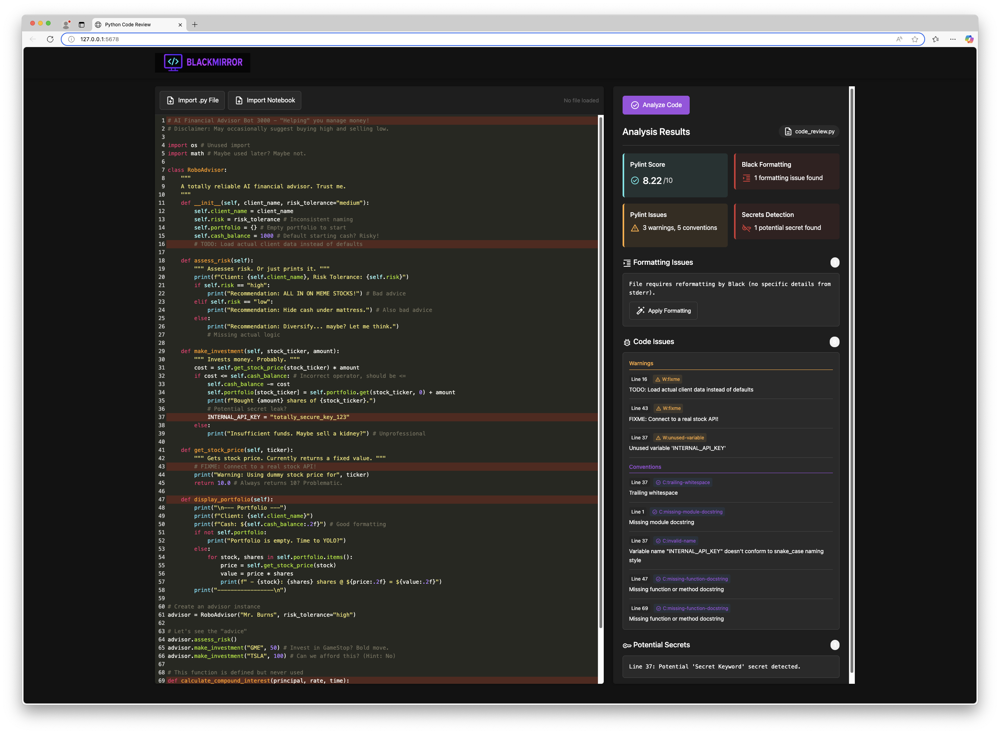

# 🪞 BlackMirror

<div align="center">



[](https://github.com/psf/black)
[](https://opensource.org/licenses/MIT)
[](https://www.python.org/downloads/)
[](CONTRIBUTING.md)
[](https://github.com/yourusername/blackmirror/stargazers)

**Reflect on your code. Unveil hidden flaws. Write better Python.**

</div>

## ✨ Overview

BlackMirror is an interactive web application designed to help developers analyze and improve their Python code through deep reflection. Paste your code, upload a `.py` file, or even provide a Jupyter Notebook (`.ipynb`), and get instant feedback on code quality, formatting, potential bugs, and security vulnerabilities.

> 💡 **"The code doesn't lie, the mirror reflects what's really there."**

## 🚀 Key Features

- **📝 Interactive Code Editor:** Uses CodeMirror for syntax highlighting, line numbers, and bracket matching
- **📤 Multiple Input Methods:**
  - Paste raw Python code directly into the editor
  - Upload `.py` files
  - Upload Jupyter Notebook (`.ipynb`) files (code is automatically extracted)
- **🔍 Comprehensive Code Analysis:**
  - **[Pylint](https://pylint.org/):** Checks for errors, enforces coding standards, looks for code smells, and provides a quality score (0-10)
  - **[Black](https://black.readthedocs.io/):** Ensures code adheres to the uncompromising Black code style
  - **[Detect-Secrets](https://github.com/Yelp/detect-secrets):** Scans for potential hardcoded secrets like API keys, passwords, and tokens
  - **🔐 Custom Security Checks:** Includes additional checks for common security pitfalls
- **📊 Detailed Results Display:** Presents analysis results with summaries and detailed issue lists
- **🔆 Line Highlighting:** Automatically highlights problematic lines in the editor
- **✅ Automatic Formatting:** Option to apply Black formatting directly to the code

## 🎮 Demo

<div align="center">
  
</div>

## 🛠️ Technology Stack

- **Backend:** Python, Flask
- **Frontend:** HTML, CSS, JavaScript, CodeMirror
- **Code Analysis Tools:**
  - Pylint
  - Black
  - Detect-Secrets
  - Nbconvert (for notebook conversion)

## 📦 Installation

```bash
# Clone the repository
git clone https://github.com/yourusername/blackmirror.git
cd blackmirror

# Create and activate a virtual environment
python -m venv venv

# On macOS/Linux:
source venv/bin/activate
# On Windows:
.\venv\Scripts\activate

# Install dependencies
pip install -r requirements.txt
```

## 🚦 Usage

```bash
# Run the Flask application
python app.py
```

1. Open your web browser and navigate to `http://127.0.0.1:5678`
2. Input your code:
   - Paste code into the editor
   - Click "Import .py File" to upload a Python file
   - Click "Import Notebook" to upload a Jupyter Notebook
3. Click the "Analyze Code" button
4. Review the results displayed in the right-hand panel
5. (Optional) If formatting issues are found, click "Apply Formatting"

## 🔎 Checks Performed

<details>
<summary>Click to expand</summary>

- **🖤 Black:** Checks if the code conforms to the Black style guide
- **🐍 Pylint:** Performs extensive static analysis, checking for:
  - Errors (e.g., syntax errors, undefined variables)
  - Warnings (e.g., unused variables, unreachable code)
  - Conventions (e.g., naming standards, docstring presence)
  - Refactoring suggestions (e.g., code complexity)
- **🔑 Detect-Secrets:** Scans for patterns commonly associated with sensitive information
- **🛡️ Custom Security Checks:** Looks for specific potentially insecure patterns like:
  - Use of insecure hash algorithms (MD5, SHA1)
  - Use of `random` module for security-sensitive operations
  - Use of `pickle`
  - Use of `tempfile.mktemp`
  - Use of `shell=True` in `subprocess` calls
  - Potential SQL injection vulnerabilities

</details>

## 🤔 How It Works

<details>
<summary>Click to expand</summary>

1. The Flask backend (`app.py`) serves the main HTML page
2. User interaction is handled by JavaScript (`static/js/script.js`)
3. When "Analyze Code" is clicked, code is sent to the `/check` endpoint
4. The `checker/utils.py` module orchestrates analysis tools execution
5. Results are parsed, aggregated, and sent back to the frontend
6. The JavaScript updates the results panel to display feedback
7. Black formatting can be applied when requested via the `/format` endpoint

</details>

## 👥 Contributing

Contributions make the open source community amazing! Any contributions you make are **greatly appreciated**.

1. Fork the Project
2. Create your Feature Branch (`git checkout -b feature/AmazingFeature`)
3. Commit your Changes (`git commit -m 'Add some AmazingFeature'`)
4. Push to the Branch (`git push origin feature/AmazingFeature`)
5. Open a Pull Request

## 📄 License

Distributed under the MIT License. See `LICENSE` for more information.

## 🙏 Acknowledgments

- [Black](https://github.com/psf/black) - The uncompromising Python code formatter
- [Pylint](https://www.pylint.org/) - Static code analyzer
- [Detect-Secrets](https://github.com/Yelp/detect-secrets) - Secret scanner
- [Flask](https://flask.palletsprojects.com/) - Web framework
- [CodeMirror](https://codemirror.net/) - Code editor component

---

<div align="center">
  <sub>Built with ❤️ by developers, for developers</sub>
</div>