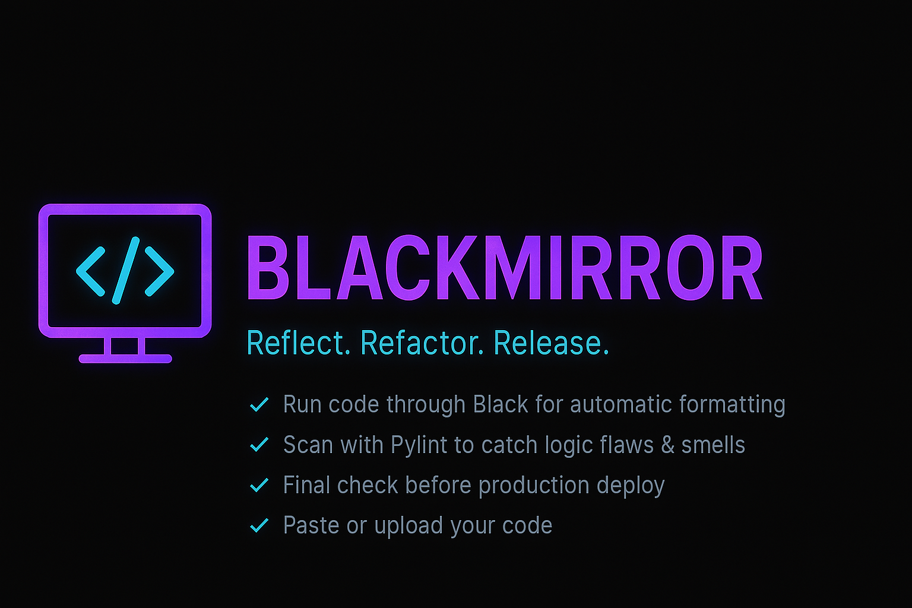
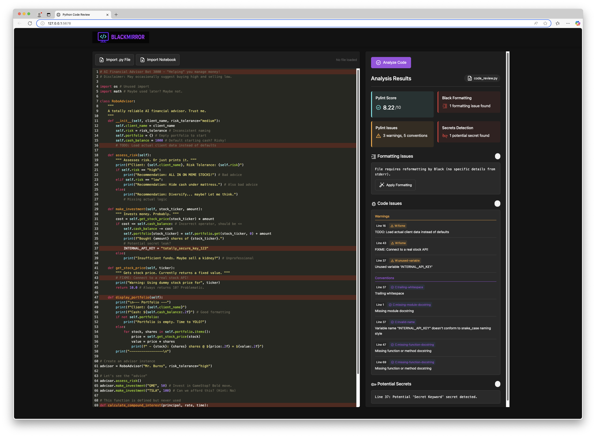

# Python Code Review Assistant

[](https://github.com/psf/black)
[](https://opensource.org/licenses/MIT)



An interactive web application designed to help developers analyze and improve their Python code. Paste your code, upload a `.py` file, or even provide a Jupyter Notebook (`.ipynb`), and get instant feedback on code quality, formatting, potential bugs, and security vulnerabilities.

## Overview

This tool provides a user-friendly interface built with Flask and CodeMirror to perform static analysis on Python code. It integrates several popular Python linting and analysis tools to offer comprehensive feedback directly in your browser.

## Key Features

*   **Interactive Code Editor:** Uses CodeMirror for syntax highlighting, line numbers, and bracket matching.
*   **Multiple Input Methods:**
    *   Paste raw Python code directly into the editor.
    *   Upload `.py` files.
    *   Upload Jupyter Notebook (`.ipynb`) files (code is automatically extracted).
*   **Comprehensive Code Analysis:**
    *   **Pylint:** Checks for errors, enforces coding standards, looks for code smells, and provides a quality score (0-10). Includes checks for docstrings, variable names, complexity, potential bugs, and more.
    *   **Black:** Ensures code adheres to the uncompromising Black code style. Identifies formatting inconsistencies and allows for automatic formatting.
    *   **Detect-Secrets:** Scans for potential hardcoded secrets like API keys, passwords, and tokens.
    *   **Custom Security Checks:** Includes additional checks for common security pitfalls (e.g., insecure hash functions, `pickle` usage, `shell=True` in subprocess, potential SQL injection patterns).
*   **Detailed Results Display:** Presents analysis results in an organized manner, showing summaries and detailed issue lists with line numbers.
*   **Line Highlighting:** Automatically highlights lines in the editor corresponding to reported Pylint issues.
*   **Automatic Formatting:** Option to apply Black formatting directly to the code in the editor.

## Demo



## Technology Stack

*   **Backend:** Python, Flask
*   **Frontend:** HTML, CSS, JavaScript, CodeMirror
*   **Code Analysis Tools:**
    *   Pylint
    *   Black
    *   Detect-Secrets
    *   Nbconvert (for notebook conversion)
*   **Dependencies:** See `requirements.txt`

## Installation

1.  **Clone the repository:**
    ```bash
    git clone <repository-url>
    cd code-review-app
    ```
2.  **Create and activate a virtual environment:**
    ```bash
    python -m venv venv
    # On macOS/Linux:
    source venv/bin/activate
    # On Windows:
    .\venv\Scripts\activate
    ```
3.  **Install dependencies:**
    ```bash
    pip install -r requirements.txt
    ```

## Usage

1.  **Run the Flask application:**
    ```bash
    python app.py
    ```
2.  **Open your web browser** and navigate to `http://127.0.0.1:5678` (or the address provided in the console).
3.  **Input your code:**
    *   Paste code into the editor.
    *   Click "Import .py File" to upload a Python file.
    *   Click "Import Notebook" to upload a Jupyter Notebook.
4.  **Click the "Analyze Code" button.**
5.  **Review the results** displayed in the right-hand panel.
6.  (Optional) If Black formatting issues are found, click "Apply Formatting" to reformat the code in the editor and re-analyze.

## How It Works

1.  The **Flask backend** (`app.py`) serves the main HTML page (`templates/index.html`).
2.  **User interaction** (pasting code, uploading files, clicking buttons) is handled by **JavaScript** (`static/js/script.js`).
3.  When "Analyze Code" is clicked, the code (or uploaded file) is sent to the `/check` endpoint on the Flask server.
4.  If a notebook is uploaded, `nbconvert` extracts the Python code first.
5.  The code is saved to a temporary file.
6.  The `checker/utils.py` module orchestrates the execution of the analysis tools (`black`, `pylint`, `detect-secrets`, custom checks) as subprocesses against the temporary file.
7.  The results (Pylint score, issues lists, secret findings) are parsed and aggregated.
8.  The aggregated results are sent back to the frontend as a JSON response.
9.  The JavaScript code dynamically updates the results panel in the HTML to display the feedback.
10. The `/format` endpoint uses the `black` library to format code directly when requested.

## Checks Performed

*   **Black:** Checks if the code conforms to the Black style guide.
*   **Pylint:** Performs extensive static analysis, checking for:
    *   Errors (e.g., syntax errors, undefined variables)
    *   Warnings (e.g., unused variables, unreachable code)
    *   Conventions (e.g., naming standards, docstring presence)
    *   Refactoring suggestions (e.g., code complexity)
    *   Provides a numerical score reflecting overall code quality.
*   **Detect-Secrets:** Scans for patterns commonly associated with sensitive information (API keys, passwords, etc.).
*   **Custom Security Checks:** Looks for specific potentially insecure patterns like:
    *   Use of insecure hash algorithms (MD5, SHA1)
    *   Use of `random` module for security-sensitive operations
    *   Use of `pickle`
    *   Use of `tempfile.mktemp`
    *   Use of `shell=True` in `subprocess` calls
    *   Potential SQL injection vulnerabilities via string formatting in `cursor.execute`

## Contributing

Contributions are welcome! Please feel free to submit pull requests or open issues for bugs, feature requests, or improvements.

*(Optional: Add more specific contribution guidelines here if desired, e.g., coding standards, testing procedures).*

## License

This project is licensed under the MIT License - see the [LICENSE](LICENSE) file for details (Note: LICENSE file not present in current structure, but declared as MIT).
